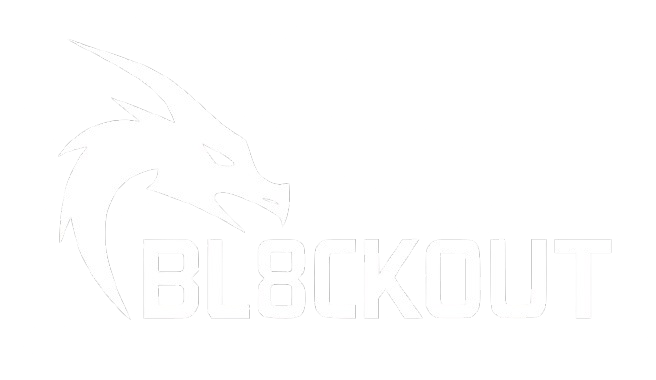

# 👋 Hey im Anton

A 16 year old developer from Germany 🇩🇪

# Projects

A lightweight media server for streaming your own collection of movies, audios or series.

---

Bl8ck0ut is a dual-ESP32 hardware prototype created to explore RF signal behavior, embedded networking, and relay-based control systems.
The project is strictly for educational experimentation in controlled environments and must not be used outside legal or ethical boundaries.
